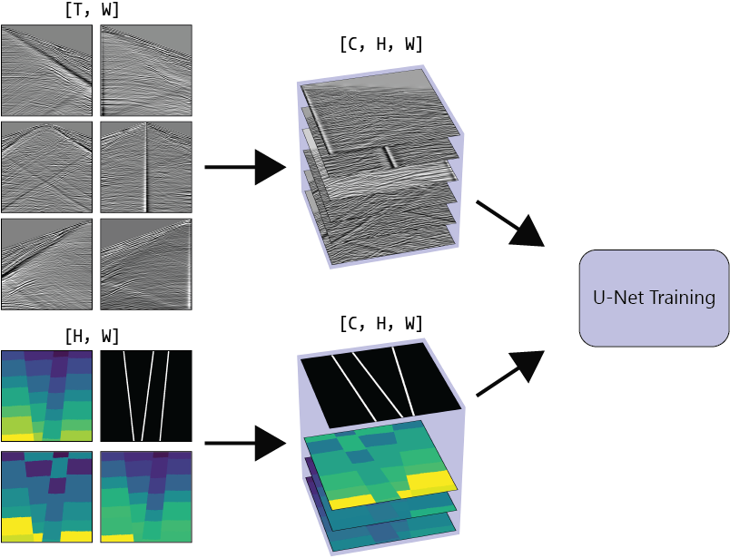
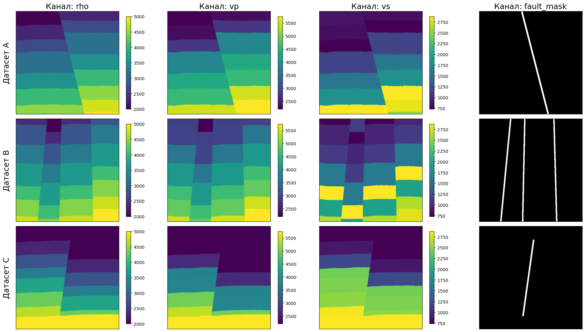
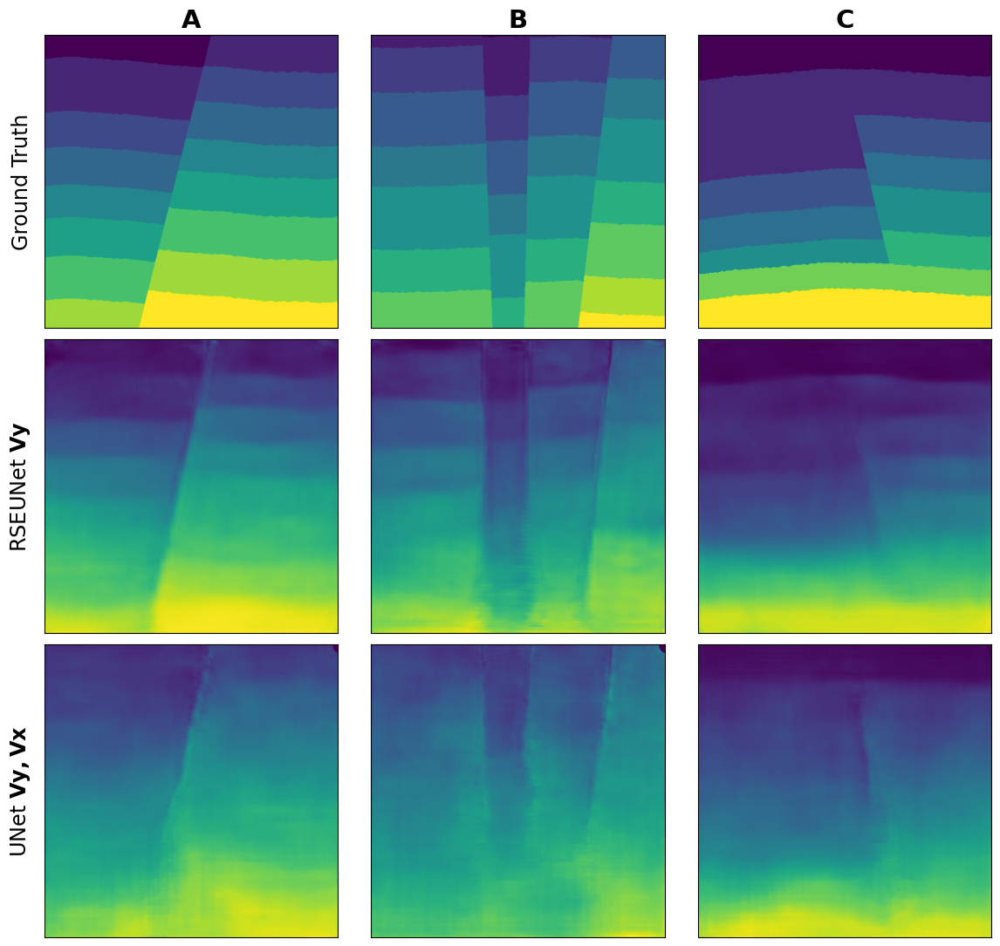
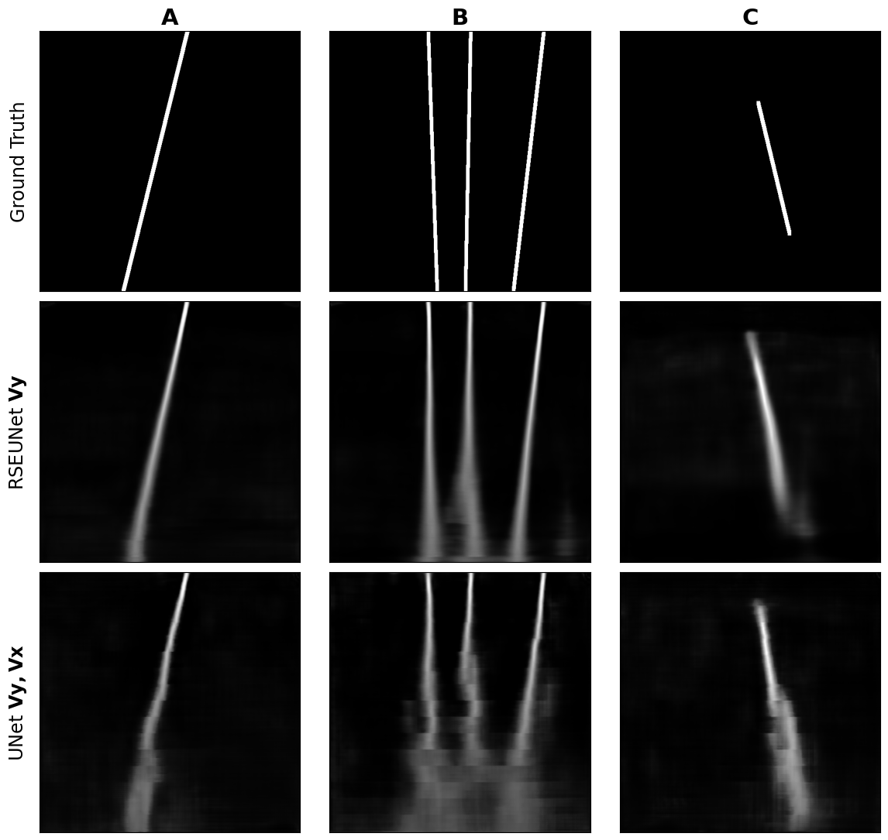

# Vision Seismic: Сегментация геологических разломов по необработанным сейсмограммам

Данный репозиторий содержит код моего научно-исследовательского проекта (дипломной работы), посвященного выделению геологических разломов напрямую из "сырых" сейсмических данных с помощью методов компьютерного зрения (Deep Learning).

## 📌 О проекте (Abstract)

Традиционные методы интерпретации сейсмических данных требуют длительной многоэтапной обработки (миграция, инверсия и т.д.). В этом проекте исследуется **End-to-End подход**: модель обучается предсказывать геологическую структуру напрямую по волновой картине (сейсмограммам).

<p align="center">
  
  <br>
  <em>Рис. 1: Постановка задачи. Входные сейсмограммы поступают в модель U-Net, которая на выходе одновременно формирует предсказание физических параметров среды и маски геологических разломов.</em>
</p>

**Ключевая особенность проекта — мультизадачное обучение (Multi-task Learning).**
Эксперименты показали, что если заставить модель решать одновременно две задачи:
1. Восстановление физических параметров среды (плотность $\rho$, скорости волн $V_p$, $V_s$),
2. Сегментация масок геологических разломов,

...то качество сегментации разломов значительно возрастает по сравнению с решением только одной задачи сегментации.

Для решения задачи была разработана и применена модифицированная архитектура **R2SE-UNet**, использующая остаточные связи (Residual) и механизмы внимания к каналам (Squeeze-and-Excitation).

## 🛠 Архитектура репозитория

Проект концептуально разделен на две большие части: пайплайн генерации синтетических данных и ML-пайплайн.

### 1. Генерация данных (`model2d_gen_new/`)
Скрипты для генерации 2D геологических структур (слои, аномалии, разломы) на основе гибких `.yaml` конфигов. После создания распределений свойств среды (VP, VS, Rho) генерируются скрипты для решения прямой задачи (симуляции распространения упругих волн с помощью программного пакета).

<p align="center">
  
  <br>
  <em>Рис. 2: Примеры синтетических геологических моделей, используемых для обучения нейросети.</em>
</p>

### 2. Обучение нейросетей (`Unet/`)
ML-пайплайн построен на **PyTorch Lightning**
* Реализован зоопарк моделей: классический UNet, DoubleRSE_UNet, кастомная архитектура UNetR2SE_AG (с Attention Gates).
* Написаны модули кастомных лосс-функций (LossCombinator, FocalLoss, SSIM_MSE, FaultIoU), адаптированные под мультизадачность.
* Реализованы коллбеки для визуализации валидации в реальном времени.

## 📊 Основные результаты

Для решения задачи была разработана модифицированная архитектура **RSE-UNet**, использующая остаточные связи (Residual) и механизмы внимания к каналам (Squeeze-and-Excitation). Мультизадачный подход позволил модели уверенно справляться со сложными краевыми случаями (например, разломами с экранирующим слоем).

### Реконструкция геологической среды

<p align="center">
  
  <br>
  <em>Рис. 3: Визуальное сравнение предсказанных геологических моделей лучшими конфигурациями: базовым U-Net (компоненты Vy, Vx) и модифицированным RSE-UNet (Vy).</em>
</p>

### Сегментация разломов

<p align="center">
  
  <br>
  <em>Рис. 4: Визуальное сравнение предсказанных масок разломов лучшими конфигурациями: базовым U-Net (Vy, Vx) и предложенным RSE-UNet (Vy).</em>
</p>

## 🚀 Стек технологий
* **Deep Learning:** PyTorch, PyTorch Lightning, TorchMetrics, Kornia
* **Data Science / Math:** NumPy, SciPy, Scikit-image, Matplotlib
* **Инфраструктура:** YAML (конфиги), SLURM (генерация баш-скриптов для кластера)

## 📊 Основные результаты
* Реализован полный цикл симуляции сейсмических данных (от геологической модели до волновой картины).
*  Продемонстрировано превосходство мультизадачной постановки (реконструкция среды + сегментация) над классической бинарной сегментацией разломов.
* Модель уверенно справляется со сложными краевыми случаями (например, вертикальными разломами с экранирующим слоем).

## ⚙️ Как запустить

**1. Генерация датасета:**
Перейдите в директорию `model2d_gen_new`. Настройте параметры в `model_configs/example_config.yaml` и запустите:
```bash
cd model2d_gen_new
python3 main.py
python3 script_gen.py
# Запуск расчета сейсмограмм (требуется внешний бинарник для расчета волнового уравнения)
python3 run_compute.py scripts/run_compute1.sh

```

2. Обучение модели:
Настройте параметры CFG (пути к данным, гиперпараметры, флаги задач) внутри Unet/train.py и запустите:
```Bash
cd Unet
python3 train.py
```
Прогресс обучения, метрики и промежуточные предсказания будут автоматически сохраняться в папку lightning_logs/ и img_logs/.

Проект разработан в рамках дипломной (научной) работы.